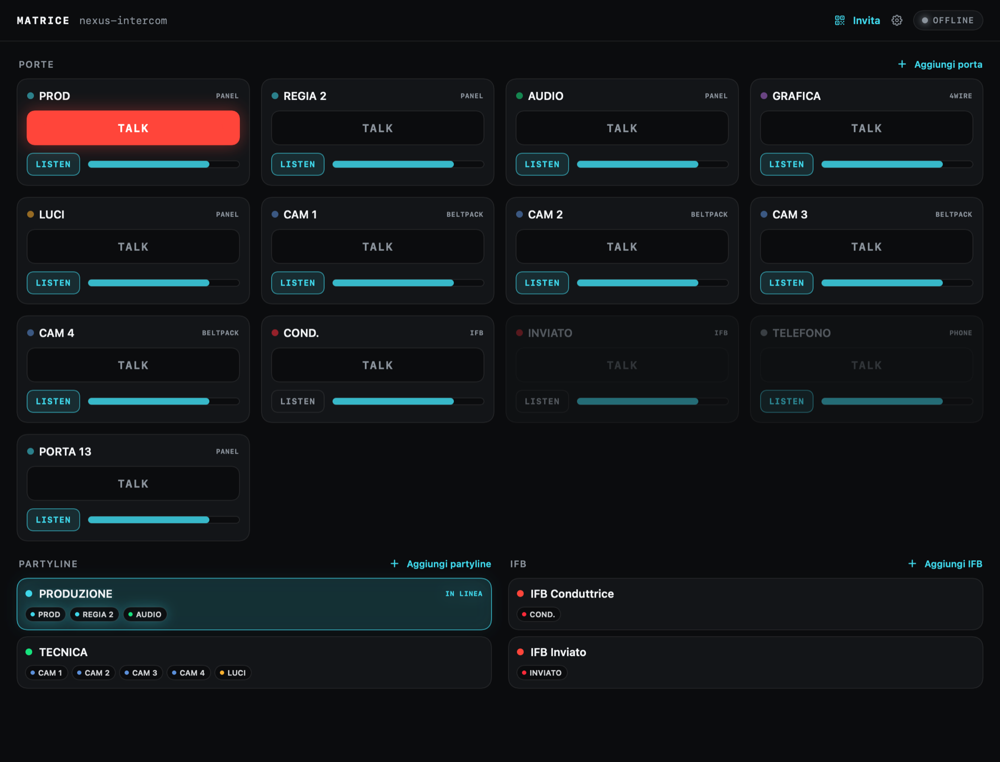
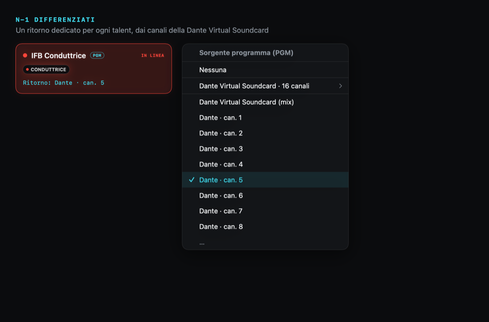
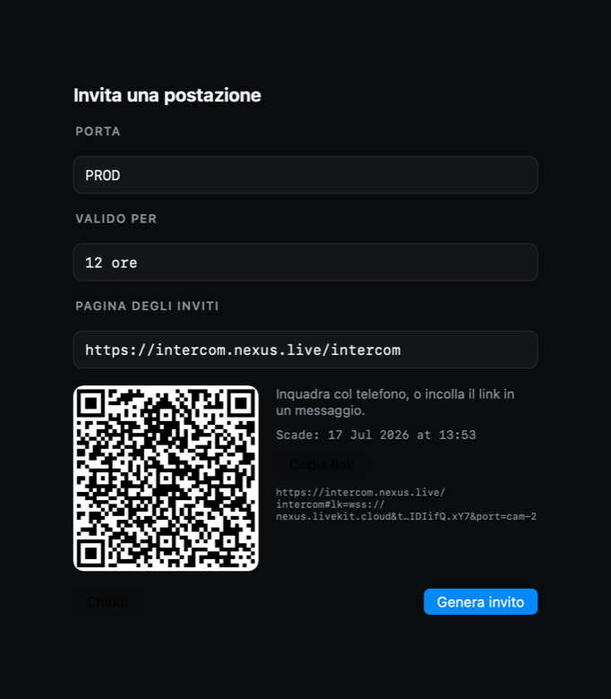
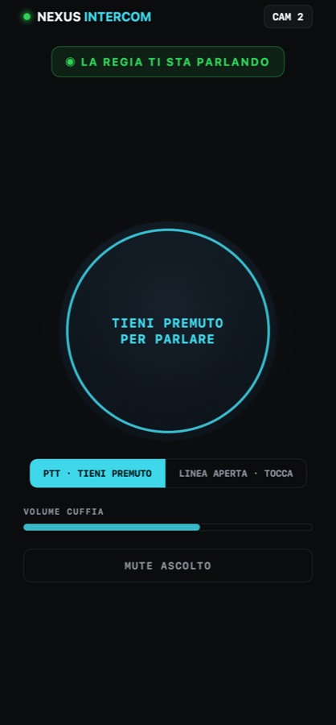
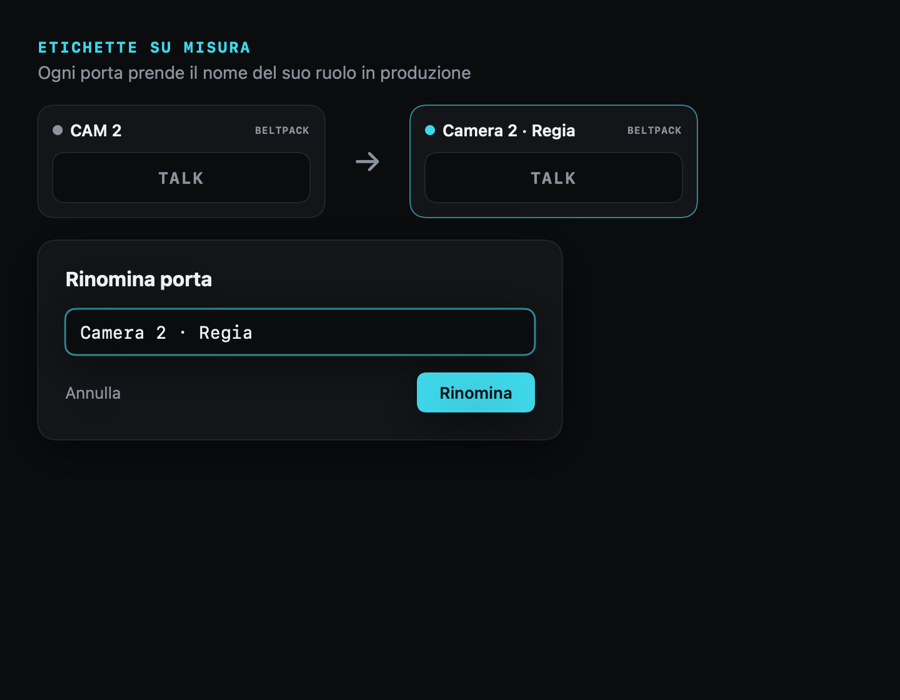

# NEXUS Intercom

### La matrice di regia, smaterializzata.

**L'intercom broadcast professionale — TALK, LISTEN, partyline, IFB e fino a 16 N-1 differenziati — su iPhone, iPad e Mac.**

`iOS` · `iPadOS` · `macOS` — **beta in test su TestFlight**

[**→ Sito di presentazione**](https://solarys431.github.io/nexus-intercom/)

---

## Cos'è

Un intercom di regia serio è una **matrice di crosspoint**: chi parla con chi, a che volume, chi lo sente. NEXUS Intercom porta quella matrice — di classe broadcast — sui dispositivi che la troupe ha già in mano. La logica gira in cloud, il segnale è audio reale a bassa latenza. Niente rack, niente cablaggi dedicati: **la regia possiede la matrice, le postazioni entrano da un link.**

---

## Funzioni principali

### Fino a 16 N-1 differenziati, dai canali di una Dante Virtual Soundcard
Ogni talent ha il suo ritorno: il programma meno la propria voce. NEXUS pesca ogni N-1 da un canale distinto della scheda Dante — un IFB, un ritorno dedicato, fino a sedici circuiti indipendenti. Si assegna con un tocco.

### La porta è un link
La regia genera un invito per una postazione — un QR o un link firmato a scadenza — e chi lo riceve apre l'intercom sul telefono. Nessun account, nessuna installazione. Beltpack in tasca: push-to-talk, volume in cuffia, mute d'ascolto.

  
  

### Su misura per la produzione
Rinomini le etichette al volo («CAM 2» → «Camera 2 · Regia»), monti partyline per reparto e circuiti IFB, e vedi a colpo d'occhio chi sta parlando. Un setup guidato collega la stanza intercom in cloud una volta, e la configurazione si propaga a tutte le postazioni.

---

## Piattaforme

| | |
|---|---|
| **iPhone** — il beltpack | Push-to-talk in tasca per operatori, inviati e conduttori. Entra da un link, funziona anche a schermo bloccato. |
| **iPad** — il panel | La matrice completa a portata di dito, per regia mobile e postazioni tecniche. |
| **Mac** — la centrale | La regia possiede la matrice e i circuiti N-1 dalla scheda Dante. Il cuore che invita e instrada tutte le porte. |

---

## Stato

**Beta — in test su TestFlight.** Questa è la pagina di presentazione del prodotto; il codice sorgente non è pubblico.

Il sito è statico (una sola pagina): nessun cookie, nessun tracciamento, nessun dato raccolto. I font sono ospitati localmente (nessuna terza parte). Gli screenshot sono autoscatti dell'app con dati dimostrativi.

© 2026 Daniele Cappello

